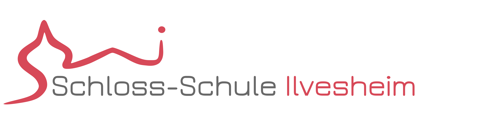

***Head

:::Icon logos/favicon.ico
:::CSS node_modules/normalize.css/normalize.css minify
:::CSS Resources/styles.css minify
:::Script Resources/scripts/mathjax-conf.js minify
:::Script https://cdn.jsdelivr.net/npm/mathjax@4.0.0-beta.3/tex-mml-chtml.js
:::Script Resources/scripts/cacc.js
:::Script Resources/scripts/cacc-conf.js minify
:::Script Resources/scripts/general-conf.js minify
:::

***

***TitleSlide

:::Title Barrierefreie Mathematik auf Webseiten mit Mathjax
:::
:::Author Barbara Henn, Michael Schäffler, Davide Cervone, Volker Sorge, Dorine in't Veld
:::

***Affiliations
***Affiliations

:::Affiliation
SBBZ Ilvesheim, Germany

[schloss-schule-ilvesheim.de](https://schloss-schule-ilvesheim.de/)
[barbara.henn|michael.schaeffler@sbbz-ilvesheim.de](mailto:barbara.henn@sbbz-ilvesheim.de)
:::


:::Affiliation
MathJax Consortium, USA

[mathjax.org](https://mathjax.org)
[v.sorge|dpvc@mathjax.org](mailto:v.sorge@mathjax.org)
:::

:::Affiliation
Dedicon, The Netherlands

[dedicon.nl](https://www.dedicon.nl/)
[dorineintVeld@dedicon.nl](mailto:dorineintVeld@dedicon.nl)
:::

*******************

## Overview

* Maths on the Web
* An introduction to MathJax
* Accessible content with MathJax
  * Now
  * Future
* Bringing it all together
  * Formulas
  * Diagrams
  * Code


## Accessibility and the Web{.notes}

* [Web Content Accessibility Guidelines (WCAG)](https://www.w3.org/TR/WCAG21/)
  * ~60 "Success Criteria" across 3 Levels: A, AA, AAA
  * A&AA is the legal basis in most countries, AAA optional/ideal
  * Not just the web but electronic material in general
* WCAG's core principles: POUR
* For **all** users all content must be:
    * Perceivable: Alt text, sub-titles
    * Operable: Keyboard, touch
    * Understandable: Language of a document
    * Robust: Not just for Browser X on OS Y
    

## Why is STEM Difficult?{.notes}

Standard recommendations like WCAG fail for STEM content:

* STEM brings together some of the hardest a11y problems
  * Specialised vernacular, scripts, tables, formulas, diagrams
  * Animations,  simulations, Interactive exercises
* STEM are infinite languages
  * meaning shifts, vernacular is added
  * aimed at diverse audiences (pubils, students, scientists)
  * difficult to understand (in particular automatically)
  * precision is important (vague recognition is not enough)
* Declarative approaches fail


## Solutions to STEM{.notes}

* Historical solutions:
  * Audio recordings, large print, Braille books
  * Use of models, tactile prints, swell paper, etc. in class
  * Exams: Specialist support needs to be provided, often one-on-one
* Curent problems:
  * Most content is in electronic form
  * Anyone can prepare material, often on the fly
  * LMS, independent work, online examinations
  * Interaction, simulations, videos, ...


## Exploit the Structure of the Web{.notes}

Distinct technologies addressing separate concerns/purposes.

[Separation of Concerns](https://en.wikipedia.org/wiki/Separation_of_concerns)
on the Web:
* [HTML](https://developer.mozilla.org/en-US/docs/Web/HTML) for
  structure
* [CSS](https://developer.mozilla.org/en-US/docs/Web/CSS) for
  presentation/layout
* JavaScript for interactivity/context adaptation
* [SVG](https://developer.mozilla.org/en-US/docs/Web/SVG) for scalable vector
  graphics
* [WAI-ARIA](https://www.w3.org/TR/wai-aria/) for (human-oriented)
  semantics/accessibility
* RDF, Owl, etc. for (machine-oriented) semantics


## Aim of my Work{.notes}

* Making STEM content accessible on the web
* Allow learners and practitioners not just to consume but to easily create
* Use the technologies and components already there
    * HTML, CSS, SVG, ARIA...  
* The web is syntax, the semantic has to come from elsewhere
    * **Note:** LaTeX, MathML, CML, MOL, etc. are all only syntax!
* Embed (and hide) rich semantic content using this Web technology
* Suitable semantically rich structure allows for
    * Support of users with diverse needs
    * Generation of alternative formats: tactile, audio-tactile, sub-titles etc.

## Sourcing Semantics{.notes}

* STEM subjects are living languages
* New concepts created everyday
* Potentially infinite
* Trying to capture this in an declarative standard is impossible
* Human input: Authors? Remedial Officers?
* Automatic
    * Exploit available sources 
    * Use intelligent methods to automatically interpret syntax
    * Avoid manual intervention as much as possible


## Math Input Standards

* [Ascii Math](http://asciimath.org/)
```LaTeX
x = (-b pm sqrt(b^2-4ac))/(2a)
```
* LaTeX
```LaTeX
x = (-b pm sqrt(b^2-4ac))/(2a)
```
* MathML
```html
<math xmlns="http://www.w3.org/1998/Math/MathML">
  <mi>x</mi>
  <mo>=</mo>
  <mfrac> ...
```

## Math Output

* Browsers do not understand Math Input languages 
  * (some exception for MathML)
* Browsers do not render Math natively
* Math rendering is not compatible with standard browser rendering model 
* Needs to be translated into suitable markup
  * HTML syntax and CSS for styling
  * SVG for graphics

## Example: A rendered Formula

$$
   x = \frac{-b \pm \sqrt{b^2-4ac}}{2a}
$$

:::Standalone Click or focus on the formula and press <kbd>ENTER</kbd> to start, <kbd>Escape</kbd> to quit.
:::

* The example uses MathJax for rendering
* Input: LaTeX, AsciiMath, and MathML
* Output: HTML/CSS, SVG

## What is MathJax?


* [MathJax](https://www.mathjax.org) is an open-source JavaScript library for
    rendering Mathematics in all
* Can take LaTeX, AsciiMath, and MathML as input
*   Generates browser output, e.g. HTML/CSS, SVG
*   MathJax is the de facto rendering solution of (nearly) all Mathematics on
    the web
* De facto rendering solution of (nearly) all Mathematics on the web:
    publishers, stackexchange, mediawiki, etc.
*   Around for nearly 15 years
    * lastest stable release: version 3.2.1
    * Version 4.0 is in beta


## Making Math Accessible

* Content is electronic and ephemeral
* The old techniques are dead!

$$
   x = \frac{-b \pm \sqrt{b^2-4ac}}{2a}
$$

* Speech via screen reading
* Self-voicing support
* Multiple rule sets for transcription
* Various locales


## MathJax and Accessibility

* Enrich Math using [Speech Rule Engine](https://speechruleengine.org){target="_blank"}
* Javascript library for translating XML into Speech (markup)
* Open source library [available at github](https://github.com/zorkow/speech-rule-engine){target="_blank"}
* Only Math speech solution in JavaScript
* Runs in browser, command line, as node module.
* Initially implemented in the context of ChromeVox
* Speech solution for: ChromeVox, MathJax, EquatIO, MathLive, ...

## Generate Semantics

* Math markup (e.g., LaTeX, MathML) are not very expressive
* SRE rewrites internally into [semantically improved term structure](https://zorkow.github.io/semantic-tree-visualiser/visualise.html?310000111100%3Cmath%3E%0A%20%20%3Cmi%3Ea%3C/mi%3E%0A%20%20%3Cmsup%3E%0A%20%20%20%20%3Cmi%3Ex%3C/mi%3E%0A%20%20%20%20%3Cmn%3E2%3C/mn%3E%0A%20%20%3C/msup%3E%0A%20%20%3Cmo%3E+%3C/mo%3E%0A%20%20%3Cmi%3Eb%3C/mi%3E%0A%20%20%3Cmi%3Ex%3C/mi%3E%0A%20%20%3Cmo%3E+%3C/mo%3E%0A%20%20%3Cmi%3Ec%3C/mi%3E%0A%20%20%3Cmo%3E%3D%3C/mo%3E%0A%20%20%3Cmn%3E0%3C/mn%3E%0A%3C/math%3E){target="_blank"}

```LaTeX
    ax^2+bx+c=0
```

```html
<math>
  <mi>a</mi>
  <msup>
    <mi>x</mi>
    <mn>2</mn>
  </msup>
  <mo>+</mo>
  <mi>b</mi>
  <mi>x</mi>
  <mo>+</mo>
  <mi>c</mi>
  <mo>=</mo>
  <mn>0</mn>
</math>
```


## Example

$$
   ax^2+bx+c=0
$$

:::Standalone Click or focus on the formula and press <kbd>ENTER</kbd> to start, <kbd>Escape</kbd> to quit.
:::

* Source in LaTeX
* Rendered with MathJax
* Embedded semantics generated with SRE
* Accessibility "built-in"


## Multi-modality

* Speech or Braille output (e.g., Nemeth)
* Linear nemeth output
  $$ \vec{\nabla} \times \vec{F} =
            \left( \frac{\partial F_z}{\partial y} - \frac{\partial F_y}{\partial z} \right) \mathbf{i}
          + \left( \frac{\partial F_x}{\partial z} - \frac{\partial F_z}{\partial x} \right) \mathbf{j}
          + \left( \frac{\partial F_y}{\partial x} - \frac{\partial F_x}{\partial y} \right) \mathbf{k}
   $${#braille}

:::Standalone Click or focus on the formula and press <kbd>ENTER</kbd> to start, <kbd>Escape</kbd> to quit.
:::


## Using MathJax day-to-day

More at [docs.mathjax.org](docs.mathjax.org)

* Transforming Math for the Web
    * Use document converter like PanDoc
    * many-to-many converter works also for documents in word, markdown, etc.
* Ensure rendering with MathJax in HTML
    * Include a [script]<https://www.mathjax.org/#gettingstarted> line to load
      MathJax from a CDN `<script id="MathJax-script" async
      src="https://cdn.jsdelivr.net/npm/mathjax@3/es5/tex-mml-chtml.js"></script>`
    * Or ask PanDoc to include it for you
* Enable Accessibility
    * Automatically included and selectable in the context menu
    * **With MJ v4 there is no need to switch it on anymore**
    * Customisation possible by including configuration options
    * Personalisation by users that are saved in a cookie
* Prerender mathematics for reading offline reading and in ePub
    readers without JavaScript support
* Accessibilty extension will not work, BUT speech can be included as
    alt text, aria-labels or descriptions


## Some Challenging Examples{.notes}

Nemeth is challenging to get right automatically, but sometimes automation is better:

* Subtlety of spaces:
   * $44\,352\,000$ is a single number and transcribes as ⠼⠲⠲⠒⠢⠆⠴⠴⠴ 
   * $(0110\,1110\,0110)$ is not a single number but a vector, hence ⠷⠼⠴⠂⠂⠴⠀⠼⠂⠂⠂⠴⠀⠼⠴⠂⠂⠴⠾
   * $(n, E) = (451{,}231)$ [The right hand side is not a single number](http://abstract.ups.edu/aata/crypt-exercises.html#grE) ⠷⠝⠠⠀⠠⠑⠾⠀⠨⠅⠀⠷⠲⠢⠂⠠⠀⠆⠒⠂⠾
* Context helps
    $$PAP^{-1} = B$$
    [is not an abbreviation](http://abstract.ups.edu/aata/ssets-ection-sets-and-equivalence-relations.html#mDC): ⠠⠏⠠⠁⠠⠏⠘⠤⠂⠀⠨⠅⠀⠠⠃

## Voicing Complex Content

  $$
  \begin{prooftree}
  \AxiomC{}
  \RightLabel{$Hyp^{1}$}
  \UnaryInfC{$P$}
  \AXC{$P\to Q$}
  \RL{$\to_E$}
  \BIC{$Q^2$}
  \AXC{$Q\to R$}
  \RL{$\to_E$}
  \BIC{$R$}
  \AXC{$Q$}
  \RL{Rit$^2$}
  \UIC{$Q$}
  \RL{$\wedge_I$}
  \BIC{$Q\wedge R$}
  \RL{$\to_I^1$}
  \UIC{$P\to Q\wedge R$}
  \end{prooftree}
  $$

:::Standalone Click or focus on the formula and press <kbd>ENTER</kbd> to start, <kbd>Escape</kbd> to quit.
:::

* Try to express this in MathML

## MathJax: Next Version

MathJax 4 will be released soon, currently in beta

* Responsive equations
* Automatic linebreaking (inline and display math)
* LaTeX to 8 dot Euro Braille support
* Recursive LaTeX subformulas
* Direct integration with screen readers via ARIA tree patterns


## Current Work{.notes}

* Semantic extraction from context
  * Work with M Balakrishnan and A Bansal, IIT Delhi
  * Concordance analysis and ML
* Self-voicing and synchronised highlighting
* Semi-graphical structures (proofs, graphs, diagrams)
* Improvement to existing rule system
  * Abstract Algebra: Permutations, cycles, cayley tables, etc.
  * Physics: Bra-ket notation, ...
  * Chemistry: info from mhchem package, automatic naming of reactants


## What about STEM Diagrams{.notes}

* WCAG says: Provide alternative text
* For STEM diagrams this is generally not enough
* Interaction is even more important to explore content
* Automatic recognition works pretty well for "information free" images
* In STEM you need precision

SVG allows to embed plenty of semantic. Where do we get it from?


## Generate with Knowledge{style="margin-bottom:.5em"}{.notes}

* Easier way to embed knowledge is, if I already know what I am talking about
* [Flowcharts from MS Visio](https://progressiveaccess.com/flowcharts/examples/)
  * Ongoing work with Dedicon (Netherlands)
* [Data Visualisations](https://progressiveaccess.com/physics)
  * From models in R with package BrailleR (with Jonathan Godfrey)
  * [A sonification example](http://127.0.0.1:8080/Progressive/Production/diagram-explorer/samples/)
  * Authors do not even realise that it is accessible out of the box


## The Challenge: Bringing it Together

Writing the fully accessible document

* Use a Clean Base Format: [PreTeXt](https://pretextbook.org/) an uncomplicated
XML vocabulary for open source textbooks, monographs, and research articles.
* PreTeXt to multiple output formats
  * Structure in XML
  * Mathematics in LaTeX
  * Graphics mainly in LaTeX
  * [Over 100 individual projects](https://pretextbook.org/catalog.html): Math, CS, engineering, music theory, ...
* with ALL components accessible
  * Math 
  * Figures
  * Code
  * ...

## The Result

[A recent research paper](https://githubraw.com/zorkow/pretext/w4a2023/w4a2023/frontmatter-1.html)


## Conclusions

* Basic mechanisms for accessible STEM on the web are available
* We just have to use them right
* Do not impede the creativity of authors
* Stay future ready: Preserve as much information as possible
    * Once it is an image the information is lost!
    * When producing formats like MathML __do not throw away your LaTeX__!
* Here we need more emphasis on
    * automatic interpretation,
    * machine learning and understanding
    * implementation of flexible workflows
